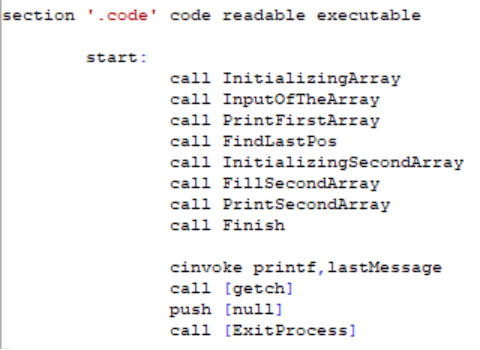
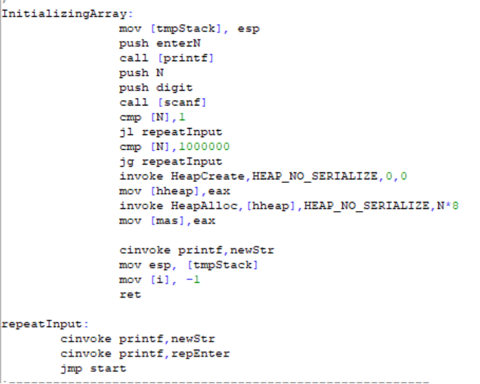
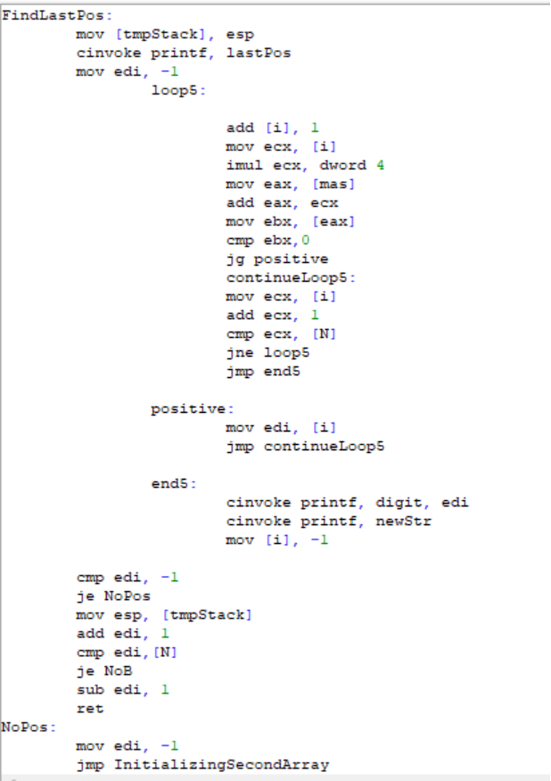
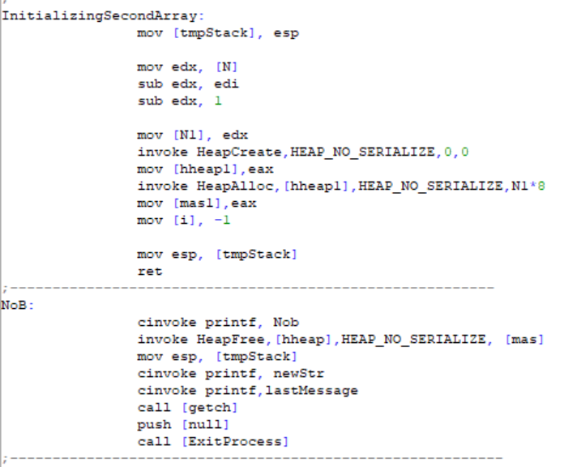
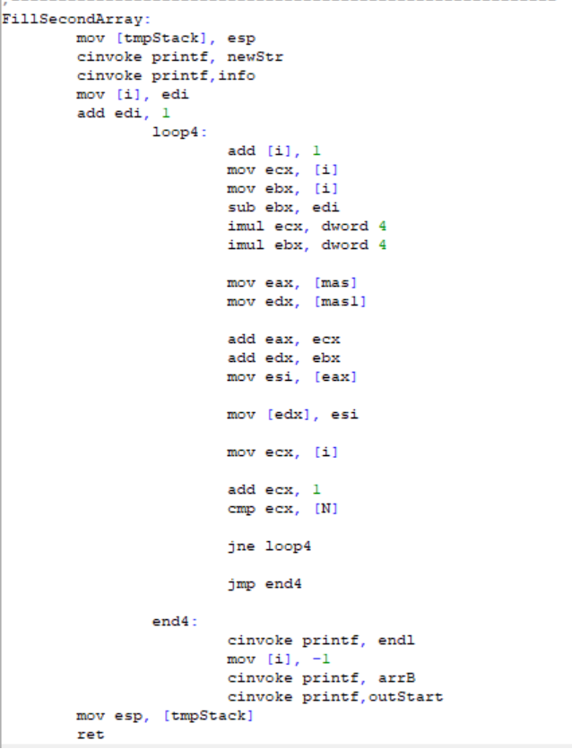
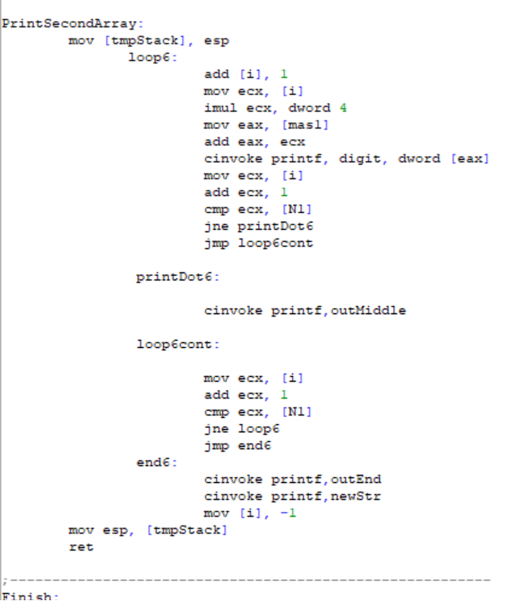
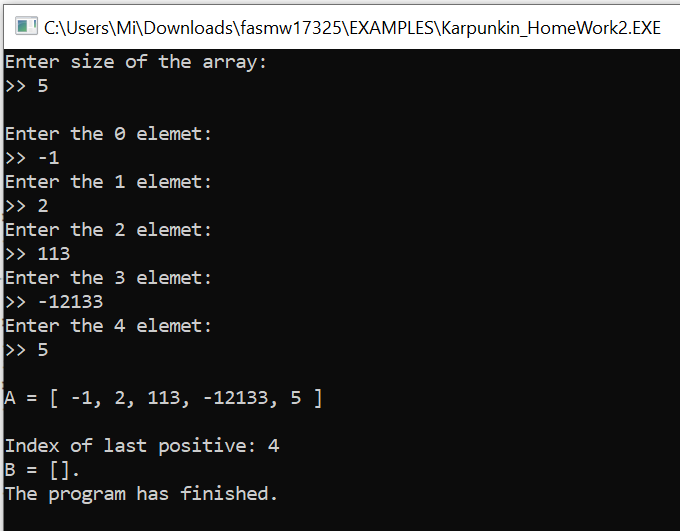
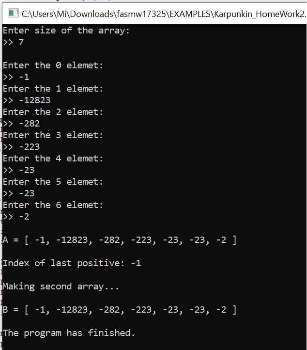
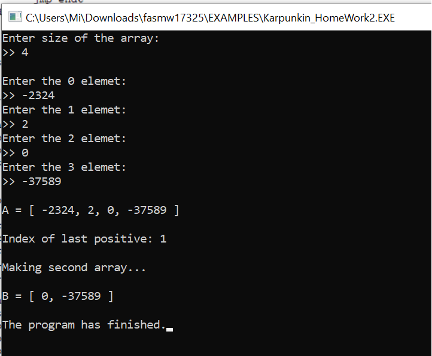

# HSE_FCS_SE-FASM

## Карпунькин Ярослав БПИ191
## Фото условия

## Решение
Во время написания программы я разбил ее на процедуры:

 
Первая инициализирует динамический массив, запасая под него место в памяти.
Это происходит с помощью функций heapCreate и heapAllocate. Также там осуществляется проверка корректности ввода количества элементов в 1 массиве.

 
Во второй процедуре 1 массив выводится на экран.
Мы пробегаемся по памяти и выводим каждый элемент.

 
В третьей процедуре мы ищем последний положительный элемент,
Отдельно рассматривая случаи, когда последний элемент положительный и когда положительных элементов в принципе нет.

 
Далее идет процедура создания 2 массива, если это необходимо, а после черны метка, на которую мы переходим, если последний элемент оказался положительным и не нужно создавать 2 массив.

 
Далее мы заполняем 2 массив необходимыми элементами.

 
После этого идет процедура вывода 2 массива на экран.

 
И в конце процедура Finish, которая чистит использованную под массивы память и подключенные библиотеки.

 
## Приведу примеры тестов программы:
В 1 примере рассматривается случай, когда вводится неверное число элементов массива.

 
Во 2 примере я рассмотрел случай, когда последний элемент оказывается положительным.

 
В 3 примере я рассмотрел случай, когда все элементы массива А отрицательны.

 
Далее, в 4 примере, я проверил корректность работы программы в случае пограничного значения – 0.

 
И последний, 5 пример – работа программы с обычными данными, без пограничных значений и исключительных ситуаций.

## Использованная литература/ интернет источники
1. Tomasz Grysztar. Flat Assembler Programmer’s Manual [Электронный
ресурс]. – Официальный сайт FASM. Режим доступа:
http://flatassembler.net/docs.php?article=manual

2. Vitali Kremez. FASM: Flat Assembler, also known as "FASM": Sample Code. [Электронный
ресурс] Режим доступа: https://vk-intel.org/2017/04/03/fasm-flat-assembler-also-known-as-fasm-sample-code/
 
